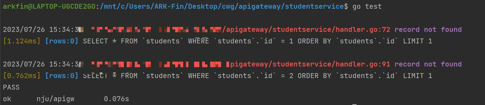
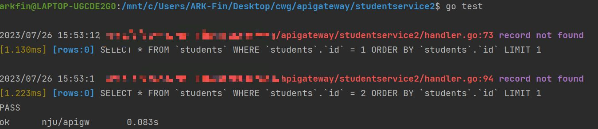
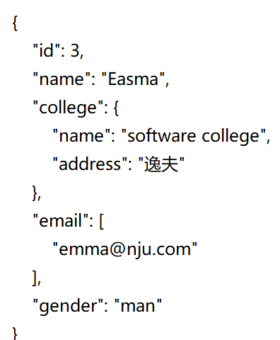
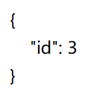
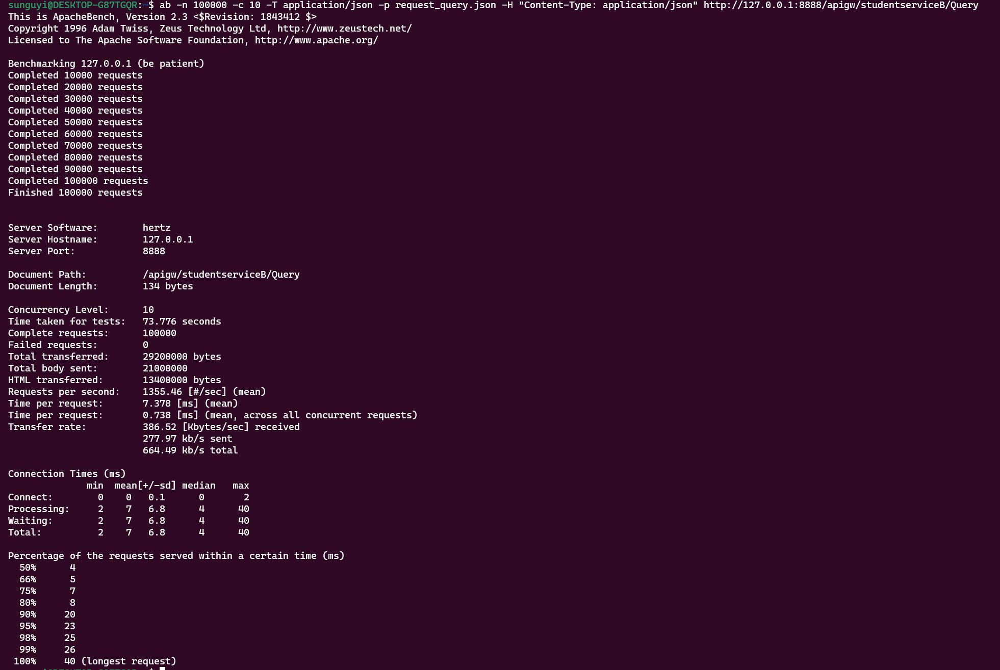

# API Gateway测试文档

## 一、引言

### 1.1编写目的

为软件开发者提供关于项目系统整体功能和性能的测试信息，是确定软件是否完整测试的重要依据。

### 1.2测试目标

保证API网关的质量，排除正常运行过程中的常见错误，尽量排除潜在的可能错误。

### 1.3测试覆盖范围

API网关的功能完整性测试、service的单元测试、性能测试、并发性测试

### 1.4提交包括

测试方案

测试用例

测试报告


## 二、测试方案

### 2.1测试配置要求

| 分类         | 运行测试                                                     |
| :----------- | ------------------------------------------------------------ |
| 运行系统     | Ubuntu64位                                                   |
| 环境配置需求 | golang、hertz工具、kitex工具、etcd工具                       |
| 数据库       | sqlite                                                       |
| 测试工具     | Apache Benchmark（ab）、testing（Go 语言标准库自带的测试库） |

### 2.2测试方法

API网关的整体功能性测试方法为手动测试，通过手动输入请求访问service，观察结果是否符合预期

性能和并发性测试同时进行，采用了Apache Benchmark（ab工具）

单元测试使用Go语言标准库自带的测试库testing，编写对应service的_test.go文件完成测试

### 2.3测试标准

通过测试的标准

1.对于API网关功能测试：能正确接受请求、调用服务、响应；能对错误请求发出相关报错

2.对于service的单元测试：测试单元可以正常提供完整服务

3.对于API网关的性能测试：可以效率较高地处理单条请求

4.对于API网关的并发性测试：在大量请求并发的情况下，仍然能较高效率地利用内存、时间等资源正确处理请求，不存在饿死或过长时间无响应的情况

5.没有优先级过高的问题

其他：小组成员讨论后认为某种程度上不满足1、2、3、4中某些标准的非重要因素可以通过测试


## 三、测试用例

详见接口文档和deployDoc2


## 四、单元测试

### 一、studentservice单元测试

测试方法：利用Go语言标准库自带的testing工具进行测试，构建测试文件

创建测试文件handle_test.go，在测试文件中编写测试用例并遍历进行测试

```bash
cd ./studentservice
go test
```



由图可见测试文件正常运行，并且该测试单元可正常提供服务

**测试结论：studentservice单元可以正常提供服务**

### 二、studentservice2单元测试

测试方法：利用Go语言标准库自带的testing工具进行测试，构建测试文件

创建测试文件handle_test.go , 在测试文件中编写测试用例并遍历进行测试

```bash
cd ./studentservice
go test
```



由图可见测试文件正常运行，并且该测试单元可正常提供服务

**测试结论：studentservice2单元可以正常提供服务**

## 五、API网关功能测试

### 5.1对于studentservice的调用请求

Register：

```bash
curl -H "Content-Type: application/json" -X POST http://127.0.0.1:8888/apigw/studentserviceA/Register -d '{"id": 103, "name":"Easma", "college": {"name": "software college", "address": "逸夫"}, "email": ["emma@nju.com"],"gender":"mm"}' -w "\n"
```

结果：

```bash
{"message":"Apigw Success!","resp":"{success:true,message:added success}"}
```

Query

```bash
curl -H "Content-Type: application/json" -X POST http://127.0.0.1:8888/apigw/studentserviceA/Query -d '{"id":103}' -w "\n"
```

结果

```bash
{"message":"Apigw Success!","resp":"{id:103,name:Easma,college:{name:software college,address:逸夫},email:[emma@nju.com]}"}
```

**测试结果：API网关基本功能完好，对studentservice的测试通过**

### 5.2对于studentservice2的调用请求

Register：

```bash
curl -H "Content-Type: application/json" -X POST http://127.0.0.1:8888/apigw/studentserviceB/Register -d '{"id": 10, "name":"Easma", "college": {"name": "software college", "address": "逸夫"}, "email": ["emma@nju.com"],"gender":"man"}' -w "\n"
```

结果：

```bash
{"message":"Apigw Success!","resp":"{success:true,message:added success}"}
```

Query

```bash
 curl -H "Content-Type: application/json" -X POST http://127.0.0.1:8888/apigw/studentserviceB/Query -d '{"id":10}' -w "\n"
```

结果

```bash
{"message":"Apigw Success!","resp":"{id:10,name:Easma,college:{name:software college,address:逸夫},email:[emma@nju.com],gender:man}"}
```

**测试结果：API网关基本功能完好，对studentservice2的测试通过**

### 5.3对于错误请求的响应：

详见接口文档

**测试结果：对错误请求的处理和响应结果基本符合预期**


## 六、性能测试

### 一、注册性能测试（由于studentservice逻辑基本一致，所以仅对更复杂的serviceB进行测试）




以上为ab测试的用例参数，位于request.json文件中

在终端中执行命令：

```bash
ab -n 100000 -c 10 -T application/json -p request.json -H "Content-Type:application/json" http://127.0.0.1:8888/apigw/studentserviceB/Register
```

使用ab工具，总共的请求执行数为100000次，并发执行数为10，参数位于request.json中，对http://127.0.0.1:8888/apigw/studentserviceB/Register进行测试，测试结果如下：


**测试结果：在10并发的情况下，面对100000条请求，共花费72.114秒处理所有请求。考虑到设备的性能局限，每秒处理的请求数仍然达到了1386.70 requests/s。对于每个用户而言，每条指令的等待时间很短。因此在这种情况下的表现基本满足期望。**


### 二、查询性能测试



以上为ab测试的用例参数，位于request.json文件中

在终端中执行命令：

```bash
ab -n 100000 -c 10 -T application/json -p request.json -H "Content-Type:application/json" http://127.0.0.1:8888/apigw/studentserviceB/Query
```

使用ab工具，总共的请求执行数为100000次，并发执行数为10，参数位于request.json中，对http://127.0.0.1:8888/apigw/studentserviceB/Register进行测试，测试结果如下：



**测试结果：在10并发的情况下，面对100000条请求，共花费73.776秒处理所有请求。消耗的时间基本与Register的测试保持一致，说明服务器的性能是限制处理速度的主要局限因素，而处理的效率基本已经达到最优。因此在这种情况下的表现基本满足期望。**

